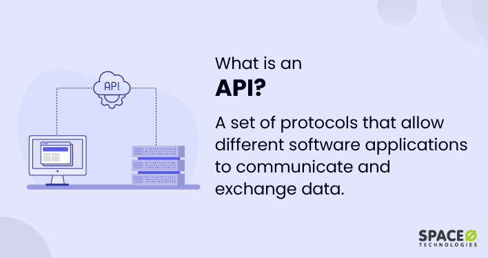
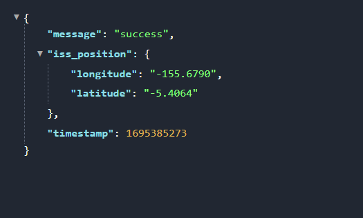

Day 33

finally learning about API's :)

### Application Programming Interfaces
An Api is a set of commands, functions, protocols and objects that programmers can use to create software or interact with an external system.

The main focus for this day is to interact with various websites and pull live data from
those websites.


<p align="center"></p>

What we try to do is to use the rules that the API has prescribed to make a request to
the external system for some piece of data, and if the request is structured according to the 
requirements of the external system has set out in their API then they will respond to you
appropriately and give you the data that you want, but if you don't follow the rules, then 
your request will be invalid, and they will tell you to go away :(

There are various API's that are present, to mention afew

- Yahoo weather has a weather API
- NBA official website has their own API
- Coinbase has their own API

### API Endpoints and Making API Calls
One of the most important aspects of an API is the API endpoint.

API endpoint is like a location, for instance we want to get data from a particular external
service then we need to know the location that data is stored. This location is what is known
as the API Endpoint

In addition to knowing the API endpoint, you also have to make a request over the internet.


Example, consider the International Space station current location API

```markdown
http://api.open-notify.org/iss-now.json
```

You can paste it in the browser and returns data in form of a JSON

NB: I'm using an extension of chrome called JSON Viewer Pro

<p align="center"></p>


### Code Implementation

```python
import requests
# This library is important for making API requests
# It has to be installed because it does not come prebuilt with Python.

requests.get(url="http://api.open-notify.org/iss-now.json")
# Using the get method to help us get the data that we want from the endpoint.
# The endpoint goes in an argument called the URL 

# Next we capture the get request into a variable namely response

response = requests.get(url="http://api.open-notify.org/iss-now.json")
# The step was just for demonstration you can call it from the previous
#line of code

print(response)

# Run the code and make sure you're connected to the internet
```

``<Response [200]>``

The requests line of code is going to go across the internet and fetch this data for us and
we get a response

From the output we did not get a JSON data like in the previous time we pasted in the internet
directly in the browser instead we see the number 200 printed here

This is our response code

### Working with Responses_ HTTP Codes, Exceptions & JSON Data
The response codes that we can get from an API 

The response codes have  a very specific meaning, but the most important thing they tell us
if our request succeeded or if it failed.

#### Summary of the status codes by the first number
    1XX: Hold on something's happening this is not the end
    2XX: Here you go everything was successful
    3XX: Go away you don't have permission to get this thing
    4XX: You screwed up
    5XX: I (Computer / Server) Screwed up

Let's continue with our snippet

```python
import requests
response = requests.get(url="http://api.open-notify.org/iss-now.json")
response.raise_for_status()
# What this code does is that it raises an exception whenever it doesn ot succeed depending on 
# the response code number

#Get hold of the actual data
data = response.json()
# This returns our data in json format
print(data)
```

Output

```markdown
{'message': 'success', 'iss_position': {'longitude': '-60.1974', 'latitude': '-50.5300'}, 'timestamp': 1695386717}
```

This is like a normal dictionary, therefore we can tap into their respective key element
pair values

Example
```python
location_data = response.json()["iss_position"]
print(location_data)
```
Output

``{'longitude': '-60.1974', 'latitude': '-50.5300'}``

### The End.

